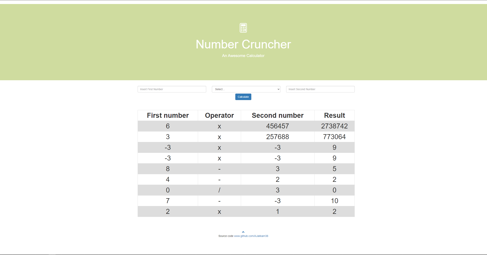

# Number Cruncher
* A simple flask Application with Nginx as HTTP webserver, uWSGI as application server and MySQL as database server.
```
                          CLIENT  ──>   NGINX   ──>   UWSGI   ──>   FLASK   <──>   MYSQL
```

### Prerequisites
* Docker 19.03
* Docker-compose version 1.27.4

### Project structure:
```
.
├── docker-compose.yaml
├── flask
|   ├── app
|       ├── templates
|       |   ├── index.html
|       |   └── simple_calculator.html
|       ├── __init__py
|       |   └── calculator.py
|   ├── .dockerignore
|   ├── app.ini 
│   ├── Dockerfile
│   ├── requirements.txt
│   └── run.py
├── init
|   └── 01.sql
├── nginx
|   ├── Dockerfile
|   └── nginx.conf
├── .gitignore
└── readme.md

```

## Deploy with docker-compose

```
$ docker-compose up
```

## Expected result

* Listing containers must show three containers running and the port mapping as below:
```
$ docker ps
CONTAINER ID        IMAGE                   COMMAND                  CREATED             STATUS              PORTS                               NAMES
31a0cc9aca6a        number-cruncher_web     "uwsgi app.ini"          About an hour ago   Up About an hour    8080/tcp                            flask
a48d0b6bc0aa        mysql:5.7               "docker-entrypoint.s…"   About an hour ago   Up About an hour    0.0.0.0:3306->3306/tcp, 33060/tcp   db
7bf6377aca37        number-cruncher_nginx   "/docker-entrypoint.…"   About an hour ago   Up About an hour    0.0.0.0:80->80/tcp                  nginx
```
* Open up http://127.0.0.1/ or http://localhost/ to see your Flask app in action. You should see:



## Stop and remove the containers in the end
```
$ docker-compose down
```
